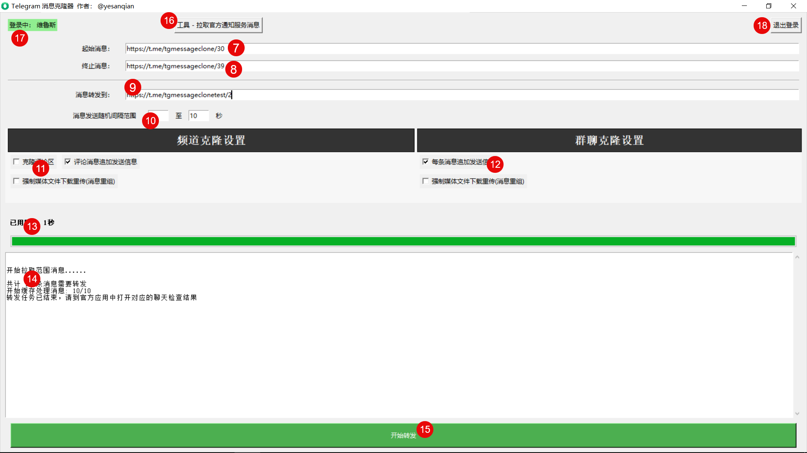

# tg-message-clone  电报消息克隆器 | 频道克隆|群组克隆 | 破解禁止转发保存下载

> **解决问题**: Telegram Restrict saving content | Telegram Content protection | Telegram Protected Content | 有下载限制的 Telegram 频道 | 不允许下载或转发 | Telegram受限制频道 | Telegram受限制群组 | 电报私密频道下载 | 电报私密群组下载 | telegram限制内容 | tg转发限制 | 破解频道/群组不允许转发保存限制 | Telegram禁止下載破解 | telegram图片下载机器人 | 下载受限制纸飞机频道视频 | 下载TG群资源的方式 | Telegram电报不允许转发下载内容 | 下载电报频道里不能保存的影片 | 下载电报频道里不能转发的影片 | 电报群内禁止下载转发保存的视频图片 | 电报群内禁止转发保存的文件 | tg频道的视频禁止转发 | tg频道的视频禁止下载 | telegram电报群禁止转发消息保存视频的解决办法 | 保存Telegram群视频与文件 | 解除telegram电报群组下载视频限制 | 有下载限制的 Telegram 频道保存照片和视频 | Telegram 上禁止复制和转发的内容 | 内容保护 | 下载破解 | 受限内容保存方法 | 视频与图片保存问题 | Telegram被封 | Telegram封号数据丢失 | 电报telegram账号数据备份

  
  
  

    
    
    
    
  

  
  <h3>🍀 电报频道克隆 | 群组克隆 | 保存受限制资源 | 电报telegram消息提取转发保存下载 | telegram channel clone </h3>
  
  

    <a href="https://t.me/tgmessageclone/" class="btn btn-primary" style="font-size: 1.2em; padding: 10px 20px; margin: 10px;">
      🌐 访问官方 Telegram 频道
    </a>
  

## 🌟 项目介绍

**tg-message-clone**是专为Telegram用户设计的资源备份及频道群组克隆备份运营工具软件，可以**完美解决Telegram群组频道设置了禁止保存和转发而无法保存精彩内容或信息的问题**。对于开启了 **禁止复制和转发 或 内容保护** 的频道群组，可以无差别实现转发克隆备份，实现数据的冗余存储，避免丢失宝贵的数据。同时支持 **频道克隆，群聊克隆** 功能。

> 📢 "告别“无法保存”的遗憾，珍藏每一份精彩！"
> 是否曾遇到过这样的无奈？
> 
> 💔 一段精彩的视频，却因“禁止下载”而无法珍藏 😢  
> 💔 一份重要的文件，却被“禁止转发”阻断了分享😢  
> 💔 一组珍贵的图片，面对“禁止保存”的提示，只能望而兴叹😢 
>
>
> 我们深刻的明白，数据即财富
> 现在，有了⭐️ tgmessageclone ⭐️，这一切都将成为过去！它专为解决你的痛点而生，帮您守护数据财富。

## 📋 核心功能

### 💬 频道克隆、群组克隆
- **完整的频道克隆与备份** - 不仅支持媒体文件的转发，同时支持媒体文件、富文本消息转发，完全保留原始消息的各种特殊格式，同时，评论区也能一比一复刻，是频道备份的绝佳选择
- **群组克隆与备份** - 对于群组的备份，除了完全保留原始消息的格式外，我们支持在每条后追加消息的原始链接、发送者、发送日期，是您持久保存信息的好帮手，无论过去多久，您都能轻松溯源。
- **一次克隆备份到多个备用频道群组** - 软件支持一次性将同一信息源备份克隆到多个目标频道群组，妈妈再也不用担心我 telegram炸号了。

### 🔐 突破Telegram复制转发保存下载限制
- **绕过内容保护限制** - Copying and forwarding is not allowed / 禁止复制和转发
- **适用公开或私有频道、群组** - 支持群组、频道中的受保护媒体下载，无论是公开频道群组，还是私密的频道群组，只要有受邀请链接，或者消息链接，就能克隆转发保存下载
- **不限媒体文件格式** - 图片(JPG/PNG/GIF/WEBP)、视频(MP4/MOV/MKV)、文档(TXT/TEXT/PDF/DOCX)、音频(MP3)等，不受文件格式影响

## 💻 系统环境

### 支持的操作系统
- **Windows** 系统

### 环境要求
- 网络: 要求能够直接访问 telegram 电报服务的网络（中国大陆需要翻墙），同时，下载速度和网络情况密切相关，如果您使用了代理，和代理质量也紧密相关

## 🚀 快速开始

### 下载与安装

从以下官方渠道获取最新版本:

- [官方频道](https://t.me/tgmessageclone/51) - 获取最新版本
- [Github 下载](https://github.com/yesanqian/tg-message-clone/releases) - 备用下载渠道

### 开始使用

1. **账号登录** - 和 Telegram 官方应用的登录流程一致
2. **快速配置** - 输入起始消息链接 和  终止消息链接(可选)，消息转发到的地址即可完成最简配置
3. **开始转发** - 点击【开始转发】按钮，并关注输出的程序运行日志即可

> 📝 详细的图文使用教程参见 👉 https://t.me/tgmessageclone/54

## 🛠️ 问题解答

有任何问题欢迎访问我们的[问题反馈与解答](https://t.me/tgmessageclone/55)。

## 👥 社区与支持

- [Telegram官方频道](https://t.me/tgmessageclone) - 获取实时帮助和交流

## 🔮 未来规划

- **跨平台支持** - 可能开发 Android 端以及更多平台
- **关键词处理** - 后续可能添加关键词处理相关功能，比如关键词替换等

---
